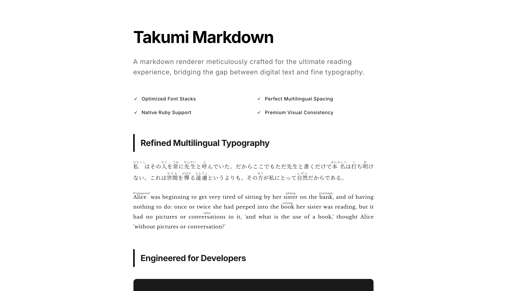
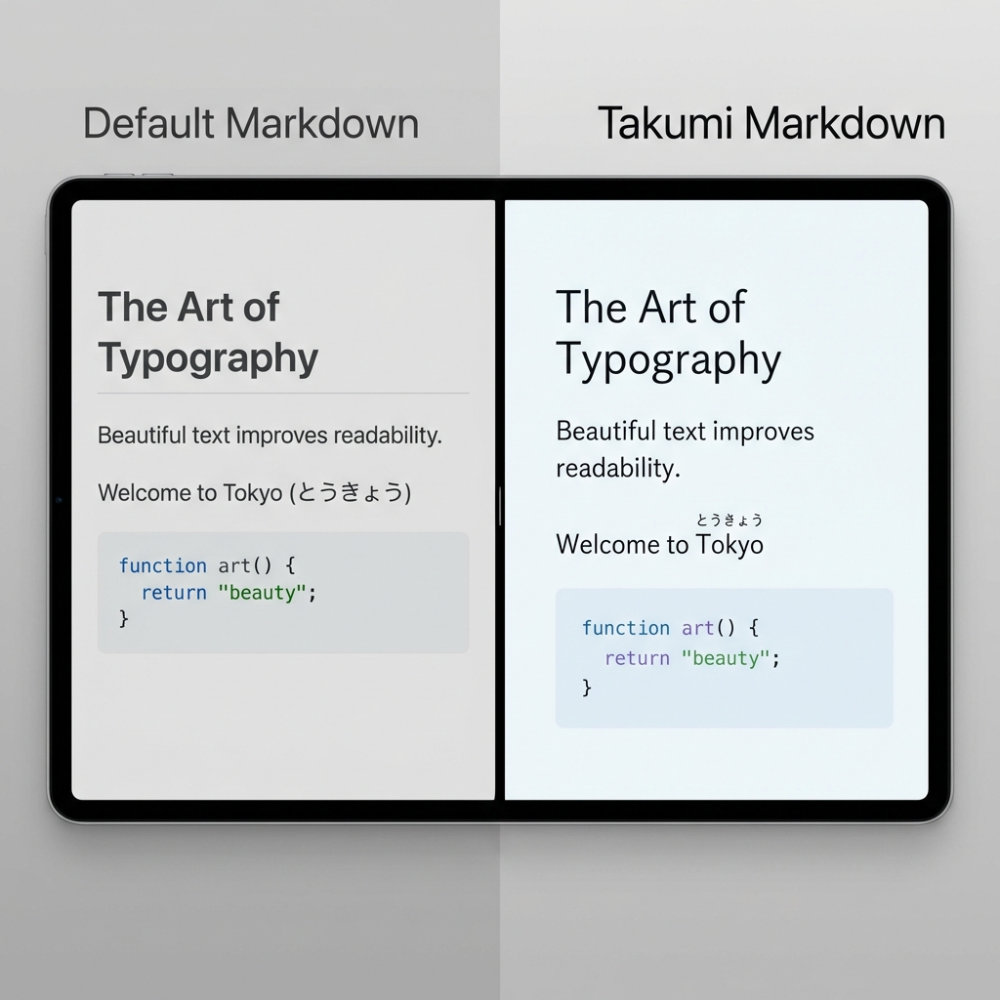

# Takumi Markdown (匠)

[](https://www.npmjs.com/package/takumi-markdown)
[](https://www.npmjs.com/package/takumi-markdown)
[](https://opensource.org/licenses/MIT)

**[🚀 Live Demo](https://ischca.github.io/takumi-markdown/)** | **[📦 npm](https://www.npmjs.com/package/takumi-markdown)**

Beautiful Markdown renderer for React, meticulously crafted for CJK (Chinese, Japanese, Korean) typography and readability.



## Philosophy

Most markdown renderers focus on functionality. Takumi focuses on the **reading experience**.
We optimize line heights, letter spacing, and font choices to create documents that feel professional and polished by default.

## Features

- 🎨 **Premium Typography** - Optimized specifically for Japanese text (C-spacing, P-alt)
- 📝 **Ruby Support** - Render `｜text《ruby》` syntax beautifully (web novel style)
- 📋 **Rich Frontmatter** - Clean metadata display
- ✨ **Modern Standards** - GFM support, syntax highlighting, and responsive tables

## Visual Experience



> **Left**: Default rendering (standard typography, raw syntax)  
> **Right**: Takumi rendering (optimized spacing, rendered rubies, premium feel)

## Installation

```bash
npm install takumi-markdown
```

## Usage

```tsx
import { MarkdownRenderer } from 'takumi-markdown';
import 'takumi-markdown/styles.css';

function App() {
  const markdown = `
# The Art of Text

Words should be beautiful.

｜Typography《タイポグラフィ》 matters.
`;

  return <MarkdownRenderer content={markdown} />;
}
```

## Ruby Notation

Supports the standard Japanese web novel format:

| Syntax | Description | Result |
|--------|-------------|--------|
| `｜text《ruby》` | Explicit | text with ruby above |
| `漢字《かんじ》` | Auto-detect | 漢字 with かんじ above |

## API

### `<MarkdownRenderer />`

| Prop | Type | Description |
|------|------|-------------|
| `content` | `string` | Markdown content to render |

### `remarkRuby`

Remark plugin for ruby notation. Exported for advanced users who want to use it with their own react-markdown setup.

```tsx
import remarkRuby from 'takumi-markdown/remarkRuby';
```

## License

MIT
